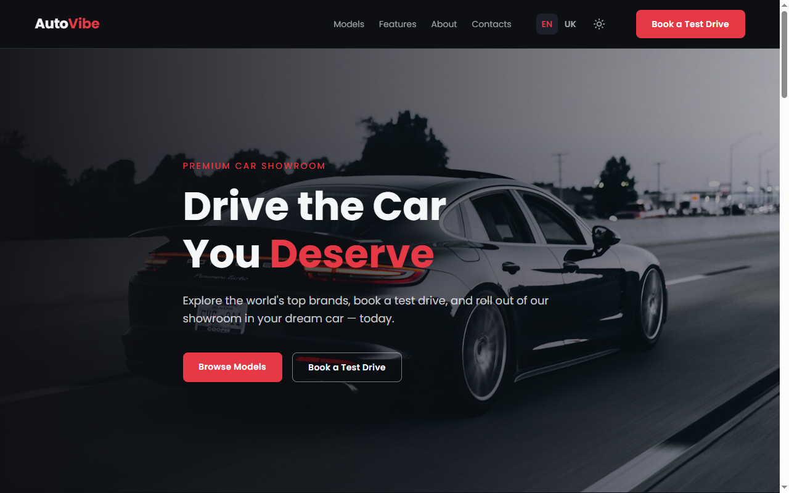

# AutoVibe — Car Showroom Landing Page

A responsive one-page landing site for a fictional premium car dealership. Static HTML/CSS/JS,
no build step, no backend.

**Live demo:** https://oleksii-rozsokha.github.io/cars-landing-claude/

## What it does

- **Hero, models, features, about and contact sections**, plus a sticky header and footer
- **Model grid** — six cars with photo, spec line and price
- **Light and dark themes**, remembered between visits, with a smooth colour-fade transition
- **Two languages** — English and Ukrainian, switchable at runtime via a small i18n dictionary
- **Mobile burger menu** with an animated icon, closes on link click
- **Scroll-to-top button** that appears after scrolling past the hero
- Fully responsive, mobile-first, no horizontal scroll at any width

The contact form is intentionally non-functional (no backend) — a design/markup piece, not a
working submission flow.

## Stack

HTML5 · CSS3 (custom properties, `clamp()`, Grid + Flexbox, BEM naming) · vanilla JavaScript.
No framework, no build tool.

## Running it locally

No install, no build. Open `index.html` directly, or serve it with any static server (e.g. the
VS Code Live Server extension) for the browser's `scroll-behavior: smooth` and relative asset
paths to work as expected.

## How it is put together

One HTML file with ten CSS sections (tokens, base, layout helpers, then one section per page
block) and one JS file with no dependencies. Every translatable string carries a `data-i18n` key
resolved against a dictionary loaded from `i18n/en.js` and `i18n/uk.js` — adding a language is a
new file, not a code change. Theme and language choices persist to `localStorage`. Colours and
spacing are two-layer custom properties — raw values in `:root`, consumed everywhere through their
semantic name — so the whole page reskins from one place.
